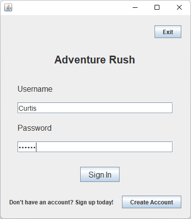

# AdventureRush

## Introduction
Retro gamers, welcome to Adventure Rush! Adventure Rush is an attempt at creating a retro-game for long-time game enthusiasts to get a glimpse into the past! We hope you have a wonderful time playing this 'ol game, just like the old-times. ;)

## Table of Contents
1. [Start up](#1-start-up)
2. [Login](#2-login)
3. [Register](#3-register)
4. [Main Menu](#4-main-menu)
    1. [Play](#a-play)
    2. [Store](#b-store)
    3. [Options](#c-options)
    4. [Logout](#d-logout)
5. [Gameplay/Objective](#5-gameplayobjective)
6. [Currency/Store](#6-currencystore)
7. [Termination](#7-termination)

## 1. Start up
The program can be started by double clicking the "AdventureRush.jar" file provided with this user manual. Alternatively, the program can also be run through the command line - simply navigate to the directory containing the JAR file and run the following command:

```$ java -jar "AdventureRush.jar"```

Upon starting the program, the login window will be shown.

## 2. Login
Upon starting the application you will be presented with the login screen. To proceed and log in you are required to have a username, password and select the "Sign in" button. Note that an empty username or password will be rejected and are permissible login credentials.

<center>
    
    
</center>

## 3. Register
If you do not already have an Adventure Rush account you can create one by clicking on the "Create Account" button. From here you can create a new account, providing a username and password. Make sure you write them down to access your account later. Once you are done you will be redirected to the sign in window automatically.

<center>
    
</center>
<br>
<center>
    
    
</center>

## 4. Main Menu
From the main menu you can access 4 buttons. To select one of the options, left click on that particular button.

<center>
    
</center>

### a. Play
This button starts the game. From this screen you can select any of the levels, 1-9. To play any level, left click on that particular level button. During a level, pressing escape in game takes you to this window to leave the current level. If the level is successfully completed, the user will automatically be returned to this menu. To return to the Main Menu from this menu, select Return.

<center>
    
</center>

### b. Store
This button opens the character shop. After completing a level you will be rewarded with coins that will allow you to buy different sprites. You can select the "Previous Sprite" or "Next Sprite" buttons to view the other sprites. If a sprite catches your eye you can select "Buy" to purchase it if you have enough coins. If you wish to play as the selected sprite, select the "Set as Default Sprite" button to equip that sprite for gameplay. Selecting Return in the Store will return you to the main menu.

<center>
    
</center>

### c. Options
This button will allow you to view the game's controls as well as the credits.    The controls button allows you to view the game's controls for movement. The credits button allows you to view the application's credits. The names of the people and their roles will be displayed. The Return button will allow you to return to the main menu.

<center>
    
</center>

### d. Logout
This button takes you out of the game and back to the login screen.

## 5. Gameplay/Objective

Upon entering a level you will be presented with a yellow rectangle on the far right side of the frame. This rectangle is the end zone upon which you must reach to complete the level. Upon making contact with the endzone, you will complete the level and be sent back to the level select screen. Green platforms are safe while red platforms are lava and will send you back to the beginning of the level. To move the character around the screen use the "w" key to jump, "a" to move to the left and "d" to move to the right. To exit from a level and return to the level select screen, you can click the escape button to abort the level. If you successfully complete a level, then you will be returned to the level select window.

<center>
    
</center>

## 6. Currency/Store
Adventure Rush has its own in-game currency "coins". This currency can be obtained from completing levels. With coins you can purchase different characters to play as through the Store. If a particular user has enough coins to purchase a specific sprite, then that particular sprite can be purchased.

## 7. Termination
Upon selecting the Exit button on the login screen (while not logged in), the program will terminate.

<center>
    
</center>